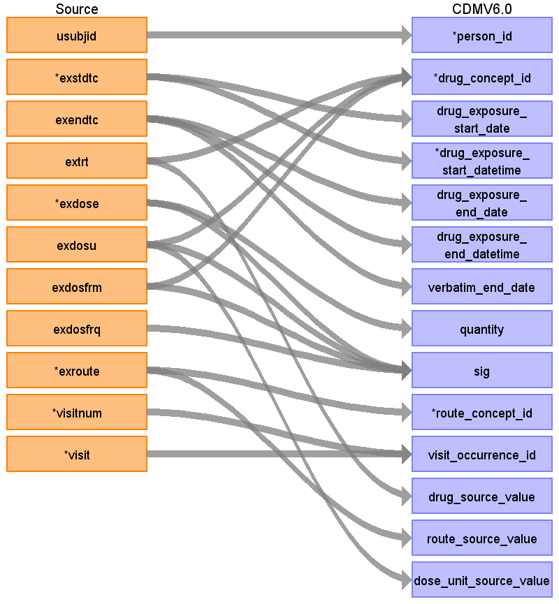

## Table name: drug_exposure

### Reading from Exposure (src.EX)

| Destination Field | Source field | Logic | Comment field |
| --- | --- | --- | --- |
| drug_exposure_id |  | A unique system generated identifier | Auto-increment |
| person_id | usubjid |  | Indirectly mapped from usubjid, which will represent the subject's person_source_value  |
| drug_concept_id | extrt exdosu exdosfrm |  | Combine extrt, exdosu and exdosfrm. A semantic mapping should be applied for the possible combinations (e.g. mapping to Xanomeline 50 mg oral tablet). |
| drug_exposure_start_date | exstdtc | if EXSTDTC includes timestamp, remove it for this target field |  |
| drug_exposure_start_datetime | exstdtc | if EXSTDTC does not include a timestamp, map time as 00:00 (midnight) |  |
| drug_exposure_end_date | exendtc | if EXENDTC includes timestamp, remove it for this target field |  |
| drug_exposure_end_datetime | exendtc | if EXENDTC does not include a timestamp, map time as 00:00 (midnight) |  |
| verbatim_end_date | exendtc | if EXENDTC includes timestamp, remove it for this target field |  |
| quantity | exdose | No EXDOSTXT in source data, so dose values will be numeric |  |
| drug_type_concept_id |  |  | Map to the new 'Case report form', concept_id 32809 |
| stop_reason |  |  |  |
| refills |  |  |  |
| days_supply |  |  |  |
| sig | exdose exdosu exdosfrm exdosfrq |  | Concatenate exdose, exdosu, exdosfrm, exdosfrq (in that order) to capture the prescription / treatment issued. For example, 81mg patch QD |
| route_concept_id | exroute |  |  |
| lot_number |  |  |  |
| provider_id |  |  |  |
| visit_occurrence_id | visit visitnum |  |  |
| visit_detail_id |  |  |  |
| drug_source_value | extrt |  |  |
| drug_source_concept_id |  |  |  |
| route_source_value | exroute |  |  |
| dose_unit_source_value | exdosu |  |  |

  
### Reading from Concomitant Medications (src.CM)
  
| Destination Field | Source field | Logic | Comment field |
| --- | --- | --- | --- |
| drug_exposure_id |  | A unique system generated identifier | Auto-increment |
| person_id | cdm.person.person_id | `JOIN cdm.person`   `ON cdm.person.person_source_value = src.cm.usubjid` |  |
| drug_concept_id | msc.target_concept_id | `COALESCE(msc.target_concept_id, 0)`   `LEFT JOIN mapped_source_codes msc`  <code>ON msc.source_code = src.cm.cmtrt</code>  <code>&#124;&#124; '&#124;'</code>  <code>&#124;&#124; src.cm.dose</code>  <code>&#124;&#124; '&#124;'</code>  <code>&#124;&#124; COALESCE(src.cm.cmdosu, '')</code>  <code>&#124;&#124; '&#124;'</code>  <code>&#124;&#124; COALESCE(src.cm.cmroute, '')</code> `AND msc.source_vocabulary_id = 'PHUSE_CM_CMTRT'` |  |
| drug_exposure_start_date | src.cm.cmstdtc | `to_date(cmstdtc)` |  |
| drug_exposure_start_datetime | NULL |  |  |
| drug_exposure_end_date | src.cm.cmendtc | `to_date(cmendtc)` |  |
| drug_exposure_end_datetime | NULL |  |  |
| verbatim_end_date | NULL |  |  |
| quantity |  |  | to be defined see lk_cm_cmdosfrq |
| drug_type_concept_id |  | Populate with 32809 | Case Report Form |
| stop_reason | NULL |  |  |
| refills | NULL |  |  |
| days_supply |  | cdm.drug_exposure.drug_exposure_end_date - cdm.drug_exposure.drug_exposure_start_date + 1 |  |
| sig |  | Concatenate cmdose, cmdosu, cmdosfrq, cmroute, use '&#124;' as a delimiter | Example: ASPIRIN &#124;1&#124;TABLET&#124;PRN&#124;ORAL |
| route_concept_id | msc.target_concept_id | `COALESCE(msc.target_concept_id, 0)` `LEFT JOIN mapped_source_codes msc` `ON msc.source_code = src.cm.cmroute` `AND msc.source_vocabulary_id = 'PHUSE_CM_CMROUTE'`  |  |
| lot_number | NULL |  |  |
| provider_id | NULL |  |  |
| visit_occurrence_id | cdm.visit_occurrence.visit_occurrence_id | `LEFT JOIN cdm.visit_occurrence vo` <code>ON vo.visit_source_value = src.cm.usubjid &#124;&#124; '&#124;' &#124;&#124; src.cm.visit &#124;&#124; '&#124;' &#124;&#124; src.cm.epoch</code>  |  |
| visit_detail_id | NULL |  |  |
| drug_source_value |  | `src.cm.cmtrt`  <code>&#124;&#124; '&#124;'</code>  <code>&#124;&#124; src.cm.dose</code>  <code>&#124;&#124; '&#124;'</code>  <code>&#124;&#124; COALESCE(src.cm.cmdosu, '')</code>  <code>&#124;&#124; '&#124;'</code>  <code>&#124;&#124; COALESCE(src.cm.cmroute, '')</code> |  |
| drug_source_concept_id |  | Populate with 0 |  |
| route_source_value | src.cm.cmroute |  |  |
| dose_unit_source_value | src.cm.cmdosu |  |  |