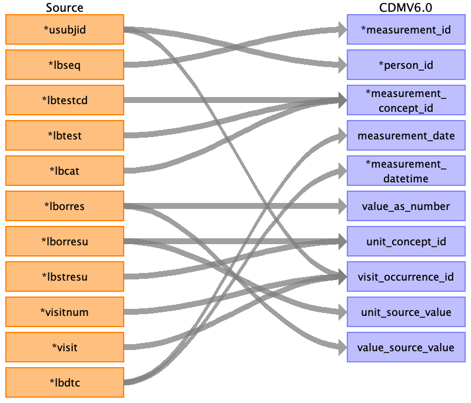

## Table name: measurement

### Reading from lbch.csv

| Destination Field | Source field | Logic | Comment field |
| --- | --- | --- | --- |
| measurement_id | lbseq |  |  |
| person_id | usubjid |  |  |
| measurement_concept_id | lbtestcd lbtest lbcat |  | See measurement.md for ID issues. Each concept below is standard, in the class Procedure and the domain Measurement    "LBTESTCD","LBTEST","LBCAT",SDTMCODE,VOCABULARY,CODE,OMOP_ID,OMOP_NAME  "ALB","Albumin","CHEMISTRY","C64431","SNOMEDCT_US","26758005",4097664,"Albumin measurement"  "ALP","Alkaline Phosphatase","CHEMISTRY","C64432","SNOMEDCT_US","88810008",4230636,"Alkaline phosphatase measurement"  "ALT","Alanine Aminotransferase","CHEMISTRY","C64433","SNOMEDCT_US","34608000",4146380,"Alanine aminotransferase measurement"  "AST","Aspartate Aminotransferase","CHEMISTRY","C64467","SNOMEDCT_US","45896001",4263457,"Aspartate aminotransferase measurement"  "BILI","Bilirubin","CHEMISTRY","C38037","SNOMEDCT_US","359986008",4230543,"Bilirubin, total measurement"  "CA","Calcium","CHEMISTRY","C64488","SNOMEDCT_US","71878006",4216722,"Calcium measurement"  "CHOL","Cholesterol","CHEMISTRY","C105586","SNOMEDCT_US","121868005",4008265,"Total cholesterol measurement"  "CK","Creatine Kinase","CHEMISTRY","C64489","SNOMEDCT_US","397798009",4265595,"Creatine kinase measurement"  "CL","Chloride","CHEMISTRY","C64495","SNOMEDCT_US","46511006",4188066,"Chloride measurement"  "CREAT","Creatinine","CHEMISTRY","C64547","SNOMEDCT_US","70901006",4324383,"Creatinine measurement"  "GGT","Gamma Glutamyl Transferase","CHEMISTRY","C64847","SNOMEDCT_US","69480007",4289475,"Gamma glutamyl transferase measurement"  "GLUC","Glucose","CHEMISTRY","C105585","SNOMEDCT_US","36048009",4149519,"Glucose measurement"  "K","Potassium","CHEMISTRY","C64853","SNOMEDCT_US","59573005",4245152,"Potassium measurement"  "PHOS","Phosphate","CHEMISTRY","C64857","SNOMEDCT_US","104866001",4017907,"Phosphate measurement"  "PROT","Protein","CHEMISTRY","C64858","SNOMEDCT_US","304383000",4119650,"Total protein measurement"  "SODIUM","Sodium","CHEMISTRY","C64809","SNOMEDCT_US","25197003",4097430,"Sodium measurement"  "URATE","Urate","CHEMISTRY","C64814","SNOMEDCT_US","86228006",4313992,"Uric acid measurement"  "UREAN","Urea Nitrogen","CHEMISTRY","C125949","SNOMEDCT_US","24509005",4074649,"Urea nitrogen measurement" |
| measurement_date | lbdtc |  |  |
| measurement_datetime | lbdtc |  |  |
| measurement_time |  |  |  |
| measurement_type_concept_id |  |  |  |
| operator_concept_id |  |  |  |
| value_as_number | lborres |  | need to establish OMOP side units and convert appropriately  |
| value_as_concept_id |  |  |  |
| unit_concept_id | lbstresu lborresu |  |  |
| range_low |  |  |  |
| range_high |  |  |  |
| provider_id |  |  |  |
| visit_occurrence_id | usubjid visitnum visit |  |  |
| visit_detail_id |  |  |  |
| measurement_source_value |  |  |  |
| measurement_source_concept_id |  |  |  |
| unit_source_value | lborresu |  |  |
| value_source_value | lborres |  |  |

