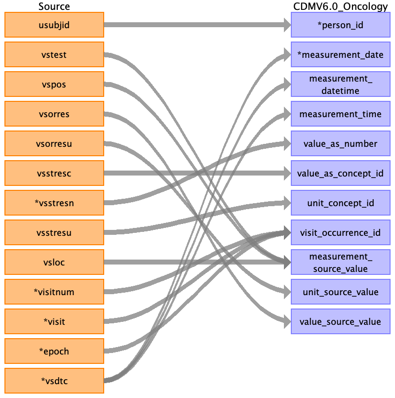

## Table name: measurement

### Reading from vs.csv

| Destination Field | Source field | Logic | Comment field |
| --- | --- | --- | --- |
| measurement_id |  |  | Auto-increment. |
| person_id | usubjid |  | Indirectly mapped from usubjid, which will represent the subject's person_source_value. |
| measurement_concept_id |  |  | Derived from measurement_source_concept_id. |
| measurement_date | vsdtc |  |  |
| measurement_datetime | vsdtc |  |  |
| measurement_time | vsdtc |  |  |
| measurement_type_concept_id |  |  | Hardcode as 32809 (Case Report Form). |
| operator_concept_id |  |  |  |
| value_as_number | vsstresn |  | VSSTRESN is the standardized result value, if numeric. |
| value_as_concept_id | vsstresc |  | Derive from VSSTRESC (the standardized result value, if categorical). |
| unit_concept_id | vsstresu |  | Derive from VSSTRESU (the standardized unit). |
| range_low |  |  |  |
| range_high |  |  |  |
| provider_id |  |  |  |
| visit_occurrence_id | visitnum visit epoch |  |  |
| visit_detail_id |  |  |  |
| measurement_source_value | vstest vspos vsloc |  | Concatenate VSTEST (name of test) + VSPOS (subject's position during test) + VSLOC (anatomic location of test)  NOTE: may need to truncate this concatenated value in the final ETL d/t 50-character limit |
| measurement_source_concept_id |  |  | Derived from measurement_source_value. |
| unit_source_value | vsorresu |  | VSORRESU is the original unit as recorded. |
| value_source_value | vsorres |  | VSORRES is the original result as recorded. |
| modifier_of_event_id |  |  |  |
| modifier_of_field_concept_id |  |  |  |

