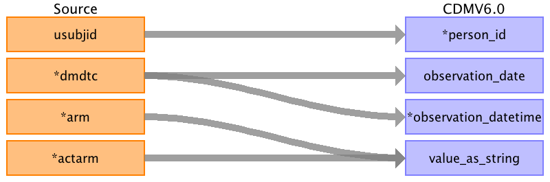
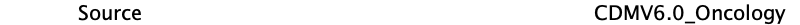

## Table name: observation

### Reading from dm.csv

| Destination Field | Source field | Logic | Comment field |
| --- | --- | --- | --- |
| observation_id |  |  A unique system generated identifier | Auto-increment |
| person_id | usubjid |  | usubjid actually stored as person value and mapped to auto incremented person id  |
| observation_concept_id |  |  | set all records to concept_id = 37208111 (clinical trial arm) |
| observation_date | dmdtc |  |  |
| observation_datetime | dmdtc |  |  |
| observation_type_concept_id |  |  | use "Case Report Form" observation type: 32809 |
| value_as_number |  |  |  |
| value_as_string | arm actarm |  | Source table contains 2 observations: arm and actarm. use a qualifier concept to distinguish |
| value_as_concept_id |  |  |  |
| qualifier_concept_id |  |  | for observation records derived from 'arm' field, hardcode 'Planned' qualifier concept id: 397943006 |
| unit_concept_id |  |  |  |
| provider_id |  |  |  |
| visit_occurrence_id |  |  |  |
| visit_detail_id |  |  |  |
| observation_source_value |  |  |  |
| observation_source_concept_id |  |  |  |
| unit_source_value |  |  |  |
| qualifier_source_value |  |  |  |
| observation_event_id |  |  |  |
| obs_event_field_concept_id |  |  |  |
| value_as_datetime |  |  |  |

### Reading from ds.csv

Trial outcomes

| Destination Field | Source field | Logic | Comment field |
| --- | --- | --- | --- |
| observation_id |  | A unique system generated identifier | Auto-increment |
| person_id | usubjid |  |  |
| observation_concept_id | dsdecod | COMPLETED - 4042840 (completed trial)  SCREEN FAILURE - xxxxx (Not eligible to participate)  WITHDRAWAL BY SUBJECT - 4163733 (withdrawn from trial)  STUDY TERMINATED BY SPONSOR - 4163733 (withdrawn from trial)  DEATH - 4163733 (withdrawn from trial)    FINAL LAB VISIT - do not capture here  FINAL RETRIEVAL VISIT - do not capture here  PROTOCOL DEVIATION - do not capture here  ADVERSE EVENT - do not capture here | There are other values possible in the dsdecod field that still have to be covered in the logic  |
| observation_source_value | dsdecod |  |  |
| observation_date | dsstdtc |  |  |
| observation_datetime | dsstdtc |  |  |
| observation_type_concept_id |  |  | xxxxxx - Case Report Form |
| value_as_number |  |  |  |
| value_as_string |  |  |  |
| value_as_concept_id | dsdecod | WITHDRAWAL BY SUBJECT - xxxxx ("Patient decided to withdraw")  STUDY TERMINATED BY SPONSOR - xxxxxxx ("Withdrawn by investigator")  DEATH - 4306655 (Death) |  |
| qualifier_concept_id |  |  |  |
| unit_concept_id |  |  |  |
| provider_id |  |  |  |
| visit_occurrence_id |  |  |  |
| visit_detail_id |  |  |  |
| observation_source_concept_id |  |  |  |
| unit_source_value |  |  |  |
| qualifier_source_value |  |  |  |
| observation_event_id |  |  |  |
| obs_event_field_concept_id |  |  |  |
| value_as_datetime |  |  |  |

### Reading from sv.csv

| Destination Field | Source field | Logic | Comment field |
| --- | --- | --- | --- |
| observation_id |  | A unique system generated identifier | Auto-increment |
| person_id | usubjid |  | Indirectly mapped from usubjid, which will represent the subject's person_source_value |
| observation_concept_id |  |  | new concept ID for "unscheduled visit reason"? |
| observation_date | svstdtc |  | svstdtc is STRING format but written as YYYY-MM-DD; convert to DATE (NOTE: svendtc will not be represented as there is no end date in the Observation table) |
| observation_datetime | svstdtc |  | svstdtc is STRING format but written as YYYY-MM-DD; convert to DATETIME with time as 00:00:00 (NOTE: svendtc will not be represented as there is no end date in the Observation table) |
| observation_type_concept_id |  |  | Hardcode as 32809 (Case Report Form) |
| value_as_number |  |  |  |
| value_as_string | svupdes |  | text of unscheduled visit reason |
| value_as_concept_id |  |  |  |
| qualifier_concept_id |  |  |  |
| unit_concept_id |  |  |  |
| provider_id |  |  |  |
| visit_occurrence_id |  |  | visit_occurrence_id for visit associated with the unscheduled visit reason |
| visit_detail_id |  |  |  |
| observation_source_value |  |  |  |
| observation_source_concept_id |  |  | new concept ID for "unscheduled visit reason"? |
| unit_source_value |  |  |  |
| qualifier_source_value |  |  |  |
| observation_event_id |  |  |  |
| obs_event_field_concept_id |  |  | visit_concept_id for visit associated with the unscheduled visit reason |
| value_as_datetime |  |  |  |

### Reading from Adverse Events: MedDRA codes (src.AE.AELLT)

| Destination Field | Source field | Logic | Comment field |
| --- | --- | --- | --- |
| observation_id |  | A unique system generated identifier | Auto-increment |
| person_id | cdm.person.person_id | `JOIN cdm.person`   `ON cdm.person.person_source_value = src.ae.usubjid` |  |
| observation_concept_id | msc.target_concept_id | `COALESCE(msc.target_concept_id, 0)`   `LEFT JOIN mapped_source_codes msc`  `ON msc.source_code = src.ae.aellt`  `AND msc.source_vocabulary_id = 'PHUSE_MedDRA'` |  |
| observation_date | src.ae.aestdtc |  |  |
| observation_datetime | NULL |  |  |
| observation_type_concept_id |  | Populate with 32809 | Case Report Form |
| value_as_number | NULL |  |  |
| value_as_string | NULL |  |  |
| value_as_concept_id | msc.value_as_concept_id | `COALESCE(msc.target_concept_id, 0)`   `LEFT JOIN mapped_source_codes msc`  `ON msc.source_code = src.ae.aellt`  `AND msc.source_vocabulary_id = 'PHUSE_MedDRA'` |  |
| qualifier_concept_id |  | Populate with 0 |  |
| unit_concept_id | NULL |  | [THEMIS #11](https://github.com/OHDSI/Themis/issues/11) |
| provider_id | NULL |  |  |
| visit_occurrence_id | NULL |  |  |
| visit_detail_id | NULL |  |  |
| observation_source_value | src.ae.aellt |  |  |
| observation_source_concept_id |  | Populate with 0 |  |
| unit_source_value | NULL |  |  |
| qualifier_source_value | NULL |  |  |
| observation_event_id | NULL |  |  |
| obs_event_field_concept_id |  | Populate with 0 |  |
| value_as_datetime | NULL |  | CDM v6.0 field  should be excluded |

### Reading from Adverse Events: Severity/Intensity (src.AE.AESEV)

| Destination Field | Source field | Logic | Comment field |
| --- | --- | --- | --- |
| observation_id |  | A unique system generated identifier | Auto-increment |
| person_id | cdm.person.person_id | `JOIN cdm.person`   `ON cdm.person.person_source_value = src.ae.usubjid` |  |
| observation_concept_id | msc.target_concept_id | `COALESCE(msc.target_concept_id, 0)`   `LEFT JOIN mapped_source_codes msc`  `ON msc.source_code = src.ae.aellt`  `AND msc.source_vocabulary_id = 'PHUSE_AE_AESEV'` |  |
| observation_date | src.ae.aestdtc |  |  |
| observation_datetime | NULL |  |  |
| observation_type_concept_id |  | Populate with 32809 | Case Report Form |
| value_as_number | NULL |  |  |
| value_as_string | src.ae.aesev |  |  |
| value_as_concept_id | msc.value_as_concept_id | `COALESCE(msc.target_concept_id, 0)`   `LEFT JOIN mapped_source_codes msc`  `ON msc.source_code = src.ae.aellt`  `AND msc.source_vocabulary_id = 'PHUSE_AE_AESEV'` |  |
| qualifier_concept_id |  | Populate with 0 |  |
| unit_concept_id | NULL |  | [THEMIS #11](https://github.com/OHDSI/Themis/issues/11) |
| provider_id | NULL |  |  |
| visit_occurrence_id | NULL |  |  |
| visit_detail_id | NULL |  |  |
| observation_source_value | src.ae.aesev |  |  |
| observation_source_concept_id |  | Populate with 0 |  |
| unit_source_value | NULL |  |  |
| qualifier_source_value | NULL |  |  |
| observation_event_id | cdm.condition_occurrence.condition_occurrence_id cdm.observation.observation_id | `JOIN cdm.condition_occurrence co` `ON co.rule_id = 'AE.1.AELLT'` `AND cdm.observation.rule_id = 'AE.2.AESEV'` `AND co.src_row = cdm.observation.src_row`  `JOIN cdm.observation obs` `ON obs.rule_id = 'AE.1.AELLT'` `AND cdm.observation.rule_id = 'AE.2.AESEV'` `AND obs.src_row = cdm.observation.src_row`| [see Topic 3](https://github.com/OHDSI/ClinicalTrialsWGETL/wiki/Topic-3:-Seriousness,-Severity-and-Causality) |
| obs_event_field_concept_id |  | `IF co.condition_occurrence_id IS NOT NULL` `THEN populate with 1147127 - condition_occurrence.condition_occurrence_id`  `IF obs.observation_id IS NOT NULL` `THEN populate with 1147165 - observation.observation_id`  `ELSE populate with 0 (or drop record)`  `JOIN cdm.condition_occurrence co` `ON co.rule_id = 'AE.1.AELLT'` `AND cdm.observation.rule_id = 'AE.2.AESEV'` `AND co.src_row = cdm.observation.src_row`  `JOIN cdm.observation obs` `ON obs.rule_id = 'AE.1.AELLT'` `AND cdm.observation.rule_id = 'AE.2.AESEV'` `AND obs.src_row = cdm.observation.src_row` | [see Topic 3](https://github.com/OHDSI/ClinicalTrialsWGETL/wiki/Topic-3:-Seriousness,-Severity-and-Causality) |
| value_as_datetime | NULL |  | CDM v6.0 field  should be excluded |
| rule_id |  | Populate with 'AE.2.AESEV' | Temp field for ETL |
| src |  | Populate with 'AE' | Temp field for ETL |
| src_row |  | Populate with the row number of the source table this record came from| Temp field for ETL |