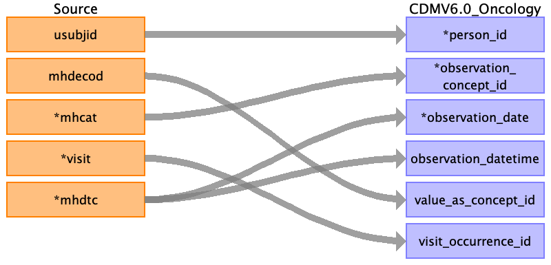
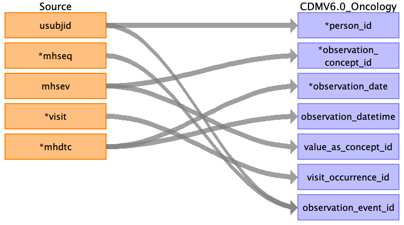

## Table name: observation

### Reading from dm.csv

 

| Destination Field | Source field | Logic | Comment |
| --- | --- | --- | --- |
| observation_id |  |  A unique system generated identifier | Auto-increment |
| person_id | usubjid |  | usubjid actually stored as person value and mapped to auto incremented person id  |
| observation_concept_id |  |  | set all records to concept_id = 37208111 (clinical trial arm) |
| observation_date | dmdtc |  |  |
| observation_datetime | dmdtc |  |  |
| observation_type_concept_id |  |  | use "Case Report Form" observation type: 32809 |
| value_as_number |  |  |  |
| value_as_string | arm actarm |  | Source table contains 2 observations: arm and actarm. use a qualifier concept to distinguish |
| value_as_concept_id |  |  |  |
| qualifier_concept_id |  |  | for observation records derived from 'arm' field, hardcode 'Planned' qualifier concept id: 397943006 |
| unit_concept_id |  |  |  |
| provider_id |  |  |  |
| visit_occurrence_id |  |  |  |
| visit_detail_id |  |  |  |
| observation_source_value |  |  |  |
| observation_source_concept_id |  |  |  |
| unit_source_value |  |  |  |
| qualifier_source_value |  |  |  |
| observation_event_id |  |  |  |
| obs_event_field_concept_id |  |  |  |
| value_as_datetime |  |  |  |
| rule_id |  | Populate with 'DM.????' | Temp field for ETL |
| src |  | Populate with 'DM' | Temp field for ETL |
| src_row |  | Populate with the row number of the source table this record came from| Temp field for ETL |

  

### Reading from ds.csv

 

Trial outcomes

| Destination Field | Source field | Logic | Comment |
| --- | --- | --- | --- |
| observation_id |  | A unique system generated identifier | Auto-increment |
| person_id | usubjid |  |  |
| observation_concept_id | dsdecod | COMPLETED - 4042840 (completed trial)  SCREEN FAILURE - xxxxx (Not eligible to participate)  WITHDRAWAL BY SUBJECT - 4163733 (withdrawn from trial)  STUDY TERMINATED BY SPONSOR - 4163733 (withdrawn from trial)  DEATH - 4163733 (withdrawn from trial)    FINAL LAB VISIT - do not capture here  FINAL RETRIEVAL VISIT - do not capture here  PROTOCOL DEVIATION - do not capture here  ADVERSE EVENT - do not capture here | There are other values possible in the dsdecod field that still have to be covered in the logic  |
| observation_source_value | dsdecod |  |  |
| observation_date | dsstdtc |  |  |
| observation_datetime | dsstdtc |  |  |
| observation_type_concept_id |  |  | xxxxxx - Case Report Form |
| value_as_number |  |  |  |
| value_as_string |  |  |  |
| value_as_concept_id | dsdecod | WITHDRAWAL BY SUBJECT - xxxxx ("Patient decided to withdraw")  STUDY TERMINATED BY SPONSOR - xxxxxxx ("Withdrawn by investigator")  DEATH - 4306655 (Death) |  |
| qualifier_concept_id |  |  |  |
| unit_concept_id |  |  |  |
| provider_id |  |  |  |
| visit_occurrence_id |  |  |  |
| visit_detail_id |  |  |  |
| observation_source_concept_id |  |  |  |
| unit_source_value |  |  |  |
| qualifier_source_value |  |  |  |
| observation_event_id |  |  |  |
| obs_event_field_concept_id |  |  |  |
| value_as_datetime |  |  |  |
| rule_id |  | Populate with 'DS.????' | Temp field for ETL |
| src |  | Populate with 'DS' | Temp field for ETL |
| src_row |  | Populate with the row number of the source table this record came from| Temp field for ETL |

  

### Reading from sv.csv

 

| Destination Field | Source field | Logic | Comment |
| --- | --- | --- | --- |
| observation_id |  | A unique system generated identifier | Auto-increment |
| person_id | usubjid |  | Indirectly mapped from usubjid, which will represent the subject's person_source_value |
| observation_concept_id |  |  | new concept ID for "unscheduled visit reason"? |
| observation_date | svstdtc |  | svstdtc is STRING format but written as YYYY-MM-DD; convert to DATE (NOTE: svendtc will not be represented as there is no end date in the Observation table) |
| observation_datetime | svstdtc |  | svstdtc is STRING format but written as YYYY-MM-DD; convert to DATETIME with time as 00:00:00 (NOTE: svendtc will not be represented as there is no end date in the Observation table) |
| observation_type_concept_id |  |  | Hardcode as 32809 (Case Report Form) |
| value_as_number |  |  |  |
| value_as_string | svupdes |  | text of unscheduled visit reason |
| value_as_concept_id |  |  |  |
| qualifier_concept_id |  |  |  |
| unit_concept_id |  |  |  |
| provider_id |  |  |  |
| visit_occurrence_id |  |  | visit_occurrence_id for visit associated with the unscheduled visit reason |
| visit_detail_id |  |  |  |
| observation_source_value |  |  |  |
| observation_source_concept_id |  |  | new concept ID for "unscheduled visit reason"? |
| unit_source_value |  |  |  |
| qualifier_source_value |  |  |  |
| observation_event_id |  |  |  |
| obs_event_field_concept_id |  |  | visit_concept_id for visit associated with the unscheduled visit reason |
| value_as_datetime |  |  |  |
| rule_id |  | Populate with 'SV.????' | Temp field for ETL |
| src |  | Populate with 'SV' | Temp field for ETL |
| src_row |  | Populate with the row number of the source table this record came from| Temp field for ETL |

  

### Mapping from Adverse Events: MedDRA codes (src.AE.AELLT)

 

| Destination Field | Source field | Logic | Comment |
| --- | --- | --- | --- |
| observation_id |  | A unique system generated identifier | Auto-increment |
| person_id | cdm.person.person_id | `JOIN cdm.person`   `ON cdm.person.person_source_value = src.ae.usubjid` |  |
| observation_concept_id | msc.target_concept_id | `COALESCE(msc.target_concept_id, 0)`   `LEFT JOIN mapped_source_codes msc`  `ON msc.source_code = src.ae.aellt`  `AND msc.source_vocabulary_id = 'PHUSE_MedDRA'` |  |
| observation_date | src.ae.aestdtc |  |  |
| observation_datetime | NULL |  |  |
| observation_type_concept_id |  | Populate with 32809 | Case Report Form |
| value_as_number | NULL |  |  |
| value_as_string | NULL |  |  |
| value_as_concept_id | msc.value_as_concept_id | `COALESCE(msc.target_concept_id, 0)`   `LEFT JOIN mapped_source_codes msc`  `ON msc.source_code = src.ae.aellt`  `AND msc.source_vocabulary_id = 'PHUSE_MedDRA'` |  |
| qualifier_concept_id |  | Populate with 0 |  |
| unit_concept_id | NULL |  | [THEMIS #11](https://github.com/OHDSI/Themis/issues/11) |
| provider_id | NULL |  |  |
| visit_occurrence_id | NULL |  |  |
| visit_detail_id | NULL |  |  |
| observation_source_value | src.ae.aellt |  |  |
| observation_source_concept_id |  | Populate with 0 |  |
| unit_source_value | NULL |  |  |
| qualifier_source_value | NULL |  |  |
| observation_event_id | NULL |  |  |
| obs_event_field_concept_id |  | Populate with 0 |  |
| value_as_datetime | NULL |  | CDM v6.0 field  should be excluded |
| rule_id |  | Populate with 'AE.1.AELLT' | Temp field for ETL |
| src |  | Populate with 'AE' | Temp field for ETL |
| src_row |  | Populate with the row number of the source table this record came from| Temp field for ETL |

  

### Mapping from Adverse Events: Severity/Intensity (src.AE.AESEV)

 

| Destination Field | Source field | Logic | Comment |
| --- | --- | --- | --- |
| observation_id |  | A unique system generated identifier | Auto-increment |
| person_id | cdm.person.person_id | `JOIN cdm.person`   `ON cdm.person.person_source_value = src.ae.usubjid` |  |
| observation_concept_id | msc.target_concept_id | `LEFT JOIN mapped_source_codes msc`  <code>ON msc.source_code = 'Severity/Intensity'</code> <code>&#124;&#124; '&#124;'</code> <code>&#124;&#124;src.ae.aesev</code>  `AND msc.source_vocabulary_id = 'PHUSE_AE_AESEV'` |  |
| observation_date | src.ae.aestdtc |  |  |
| observation_datetime | NULL |  |  |
| observation_type_concept_id |  | Populate with 32809 | Case Report Form |
| value_as_number | NULL |  |  |
| value_as_string | src.ae.aesev |  |  |
| value_as_concept_id | msc.value_as_concept_id | `COALESCE(msc.target_concept_id, 0)`   `LEFT JOIN mapped_source_codes msc`  <code>ON msc.source_code = 'Severity/Intensity'</code> <code>&#124;&#124; '&#124;'</code> <code>&#124;&#124;src.ae.aesev</code>  `AND msc.source_vocabulary_id = 'PHUSE_AE_AESEV'` |  |
| qualifier_concept_id |  | Populate with 0 |  |
| unit_concept_id | NULL |  | [THEMIS #11](https://github.com/OHDSI/Themis/issues/11) |
| provider_id | NULL |  |  |
| visit_occurrence_id | NULL |  |  |
| visit_detail_id | NULL |  |  |
| observation_source_value | src.ae.aesev | <code>'Severity/Intensity'</code> <code>&#124;&#124; '&#124;'</code> <code>&#124;&#124;src.ae.aesev</code> |  |
| observation_source_concept_id |  | Populate with 0 |  |
| unit_source_value | NULL |  |  |
| qualifier_source_value | NULL |  |  |
| observation_event_id | cdm.condition_occurrence. condition_occurrence_id, cdm.observation.observation_id | `JOIN cdm.condition_occurrence co` `ON co.rule_id = 'AE.1.AELLT'` `AND cdm.observation.rule_id = 'AE.2.AESEV'` `AND co.src_row = cdm.observation.src_row`  `JOIN cdm.observation obs` `ON obs.rule_id = 'AE.1.AELLT'` `AND cdm.observation.rule_id = 'AE.2.AESEV'` `AND obs.src_row = cdm.observation.src_row`| [see Topic 3](https://github.com/OHDSI/ClinicalTrialsWGETL/wiki/Topic-3:-Seriousness,-Severity-and-Causality) |
| obs_event_field_concept_id |  | `IF co.condition_occurrence_id IS NOT NULL` `THEN populate with 1147127 - condition_occurrence.` `condition_occurrence_id`  `IF obs.observation_id IS NOT NULL` `THEN populate with 1147165 - observation.observation_id`  `ELSE populate with 0 (or drop record)`  `JOIN cdm.condition_occurrence co` `ON co.rule_id = 'AE.1.AELLT'` `AND cdm.observation.rule_id = 'AE.2.AESEV'` `AND co.src_row = cdm.observation.src_row`  `JOIN cdm.observation obs` `ON obs.rule_id = 'AE.1.AELLT'` `AND cdm.observation.rule_id = 'AE.2.AESEV'` `AND obs.src_row = cdm.observation.src_row` | [see Topic 3](https://github.com/OHDSI/ClinicalTrialsWGETL/wiki/Topic-3:-Seriousness,-Severity-and-Causality) |
| value_as_datetime | NULL |  | CDM v6.0 field  should be excluded |
| rule_id |  | Populate with 'AE.2.AESEV' | Temp field for ETL |
| src |  | Populate with 'AE' | Temp field for ETL |
| src_row |  | Populate with the row number of the source table this record came from| Temp field for ETL |

 

### Mapping from Adverse Events: Seriousness (src.AE.AESER)

 

| Destination Field | Source field | Logic | Comment |
| --- | --- | --- | --- |
| observation_id |  | A unique system generated identifier | Auto-increment |
| person_id | cdm.person.person_id | `JOIN cdm.person`   `ON cdm.person.person_source_value = src.ae.usubjid` |  |
| observation_concept_id | msc.target_concept_id | `LEFT JOIN mapped_source_codes msc` `ON msc.source_code = 'Serious Event'` <code>&#124;&#124; '&#124;'</code> <code>&#124;&#124; src.ae.aeser</code>  `AND msc.source_vocabulary_id = 'PHUSE_AE_AESER'` |  |
| observation_date | src.ae.aestdtc |  |  |
| observation_datetime | NULL |  |  |
| observation_type_concept_id |  | Populate with 32809 | Case Report Form |
| value_as_number | NULL |  |  |
| value_as_string | NULL |  |  |
| value_as_concept_id | msc.value_as_concept_id | `COALESCE(msc.target_concept_id, 0)`   `LEFT JOIN mapped_source_codes msc`  `ON msc.source_code = 'Serious Event'` <code>&#124;&#124; '&#124;'</code> <code>&#124;&#124; src.ae.aeser</code>  `AND msc.source_vocabulary_id = 'PHUSE_AE_AESER'` |  |
| qualifier_concept_id |  | Populate with 0 |  |
| unit_concept_id | NULL |  | [THEMIS #11](https://github.com/OHDSI/Themis/issues/11) |
| provider_id | NULL |  |  |
| visit_occurrence_id | NULL |  |  |
| visit_detail_id | NULL |  |  |
| observation_source_value | src.ae.aeser | `'Serious Event'` <code>&#124;&#124; '&#124;'</code> <code>&#124;&#124; src.ae.aeser</code> |  |
| observation_source_concept_id |  | Populate with 0 |  |
| unit_source_value | NULL |  |  |
| qualifier_source_value | NULL |  |  |
| observation_event_id | cdm.condition_occurrence. condition_occurrence_id, cdm.observation.observation_id | `JOIN cdm.condition_occurrence co` `ON co.rule_id = 'AE.1.AELLT'` `AND cdm.observation.rule_id = 'AE.3.AESER'` `AND co.src_row = cdm.observation.src_row`  `JOIN cdm.observation obs` `ON obs.rule_id = 'AE.1.AELLT'` `AND cdm.observation.rule_id = 'AE.3.AESER'` `AND obs.src_row = cdm.observation.src_row`| [see Topic 3](https://github.com/OHDSI/ClinicalTrialsWGETL/wiki/Topic-3:-Seriousness,-Severity-and-Causality) |
| obs_event_field_concept_id |  | `IF co.condition_occurrence_id IS NOT NULL` `THEN populate with 1147127 - condition_occurrence.` `condition_occurrence_id`  `IF obs.observation_id IS NOT NULL` `THEN populate with 1147165 - observation.observation_id`  `ELSE populate with 0 (or drop record)`  `JOIN cdm.condition_occurrence co` `ON co.rule_id = 'AE.1.AELLT'` `AND cdm.observation.rule_id = 'AE.3.AESER'` `AND co.src_row = cdm.observation.src_row`  `JOIN cdm.observation obs` `ON obs.rule_id = 'AE.1.AELLT'` `AND cdm.observation.rule_id = 'AE.3.AESER'` `AND obs.src_row = cdm.observation.src_row` | [see Topic 3](https://github.com/OHDSI/ClinicalTrialsWGETL/wiki/Topic-3:-Seriousness,-Severity-and-Causality) |
| value_as_datetime | NULL |  | CDM v6.0 field  should be excluded |
| rule_id |  | Populate with 'AE.3.AESER' | Temp field for ETL |
| src |  | Populate with 'AE' | Temp field for ETL |
| src_row |  | Populate with the row number of the source table this record came from| Temp field for ETL |

 

### Mapping from Adverse Events: Relation to the Study Drug (src.AE.AEREL)

 

| Destination Field | Source field | Logic | Comment |
| --- | --- | --- | --- |
| observation_id |  | A unique system generated identifier | Auto-increment |
| person_id | cdm.person.person_id | `JOIN cdm.person`   `ON cdm.person.person_source_value = src.ae.usubjid` |  |
| observation_concept_id | msc.target_concept_id | `LEFT JOIN mapped_source_codes msc` `ON msc.source_code = 'Relationship to Study Drug (Causality)'` <code>&#124;&#124; '&#124;'</code> <code>&#124;&#124; src.ae.aerel</code>  `AND msc.source_vocabulary_id = 'PHUSE_AE_AEREL'` |  |
| observation_date | src.ae.aestdtc |  |  |
| observation_datetime | NULL |  |  |
| observation_type_concept_id |  | Populate with 32809 | Case Report Form |
| value_as_number | NULL |  |  |
| value_as_string | NULL |  |  |
| value_as_concept_id | msc.value_as_concept_id | `COALESCE(msc.target_concept_id, 0)`   `LEFT JOIN mapped_source_codes msc`  `ON msc.source_code = 'Relationship to Study Drug (Causality)'` <code>&#124;&#124; '&#124;'</code> <code>&#124;&#124; src.ae.aerel</code>  `AND msc.source_vocabulary_id = 'PHUSE_AE_AEREL'` |  |
| qualifier_concept_id |  | Populate with 0 |  |
| unit_concept_id | NULL |  | [THEMIS #11](https://github.com/OHDSI/Themis/issues/11) |
| provider_id | NULL |  |  |
| visit_occurrence_id | NULL |  |  |
| visit_detail_id | NULL |  |  |
| observation_source_value | src.ae.aerel | `'Relationship to Study Drug (Causality)'` <code>&#124;&#124; '&#124;'</code> <code>&#124;&#124; src.ae.aerel</code> |  |
| observation_source_concept_id |  | Populate with 0 |  |
| unit_source_value | NULL |  |  |
| qualifier_source_value | NULL |  |  |
| observation_event_id | cdm.condition_occurrence. condition_occurrence_id, cdm.observation.observation_id | `JOIN cdm.condition_occurrence co` `ON co.rule_id = 'AE.1.AELLT'` `AND cdm.observation.rule_id = 'AE.4.AEREL'` `AND co.src_row = cdm.observation.src_row`  `JOIN cdm.observation obs` `ON obs.rule_id = 'AE.1.AELLT'` `AND cdm.observation.rule_id = 'AE.4.AEREL'` `AND obs.src_row = cdm.observation.src_row`| [see Topic 3](https://github.com/OHDSI/ClinicalTrialsWGETL/wiki/Topic-3:-Seriousness,-Severity-and-Causality) |
| obs_event_field_concept_id |  | `IF co.condition_occurrence_id IS NOT NULL` `THEN populate with 1147127 - condition_occurrence.` `condition_occurrence_id`  `IF obs.observation_id IS NOT NULL` `THEN populate with 1147165 - observation.observation_id`  `ELSE populate with 0 (or drop record)`  `JOIN cdm.condition_occurrence co` `ON co.rule_id = 'AE.1.AELLT'` `AND cdm.observation.rule_id = 'AE.4.AEREL'` `AND co.src_row = cdm.observation.src_row`  `JOIN cdm.observation obs` `ON obs.rule_id = 'AE.1.AELLT'` `AND cdm.observation.rule_id = 'AE.4.AEREL'` `AND obs.src_row = cdm.observation.src_row` | [see Topic 3](https://github.com/OHDSI/ClinicalTrialsWGETL/wiki/Topic-3:-Seriousness,-Severity-and-Causality) |
| value_as_datetime | NULL |  | CDM v6.0 field  should be excluded |
| rule_id |  | Populate with 'AE.4.AEREL' | Temp field for ETL |
| src |  | Populate with 'AE' | Temp field for ETL |
| src_row |  | Populate with the row number of the source table this record came from| Temp field for ETL |

 

### Mapping from Adverse Events: Outcome of Adverse Event (src.AE.AEOUT)

 

| Destination Field | Source field | Logic | Comment |
| --- | --- | --- | --- |
| observation_id |  | A unique system generated identifier | Auto-increment |
| person_id | cdm.person.person_id | `JOIN cdm.person`   `ON cdm.person.person_source_value = src.ae.usubjid` |  |
| observation_concept_id | msc.target_concept_id | `LEFT JOIN mapped_source_codes msc` `ON msc.source_code = 'Outcome of Adverse Event'` <code>&#124;&#124; '&#124;'</code> <code>&#124;&#124; src.ae.aeout</code>  `AND msc.source_vocabulary_id = 'PHUSE_AE_AEOUT'` |  |
| observation_date | src.ae.aestdtc |  |  |
| observation_datetime | NULL |  |  |
| observation_type_concept_id |  | Populate with 32809 | Case Report Form |
| value_as_number | NULL |  |  |
| value_as_string | NULL |  |  |
| value_as_concept_id | msc.value_as_concept_id | `COALESCE(msc.target_concept_id, 0)`   `LEFT JOIN mapped_source_codes msc`  `ON msc.source_code = 'Outcome of Adverse Event'` <code>&#124;&#124; '&#124;'</code> <code>&#124;&#124; src.ae.aeout</code>  `AND msc.source_vocabulary_id = 'PHUSE_AE_AEOUT'` |  |
| qualifier_concept_id |  | Populate with 0 |  |
| unit_concept_id | NULL |  | [THEMIS #11](https://github.com/OHDSI/Themis/issues/11) |
| provider_id | NULL |  |  |
| visit_occurrence_id | NULL |  |  |
| visit_detail_id | NULL |  |  |
| observation_source_value | src.ae.aeout | `'Outcome of Adverse Event'` <code>&#124;&#124; '&#124;'</code> <code>&#124;&#124; src.ae.aeout</code> |  |
| observation_source_concept_id |  | Populate with 0 |  |
| unit_source_value | NULL |  |  |
| qualifier_source_value | NULL |  |  |
| observation_event_id | cdm.condition_occurrence. condition_occurrence_id, cdm.observation.observation_id | `JOIN cdm.condition_occurrence co` `ON co.rule_id = 'AE.1.AELLT'` `AND cdm.observation.rule_id = 'AE.5.AEOUT'` `AND co.src_row = cdm.observation.src_row`  `JOIN cdm.observation obs` `ON obs.rule_id = 'AE.1.AELLT'` `AND cdm.observation.rule_id = 'AE.5.AEOUT'` `AND obs.src_row = cdm.observation.src_row`| [see Topic 3](https://github.com/OHDSI/ClinicalTrialsWGETL/wiki/Topic-3:-Seriousness,-Severity-and-Causality) |
| obs_event_field_concept_id |  | `IF co.condition_occurrence_id IS NOT NULL` `THEN populate with 1147127 - condition_occurrence.` `condition_occurrence_id`  `IF obs.observation_id IS NOT NULL` `THEN populate with 1147165 - observation.observation_id`  `ELSE populate with 0 (or drop record)`  `JOIN cdm.condition_occurrence co` `ON co.rule_id = 'AE.1.AELLT'` `AND cdm.observation.rule_id = 'AE.5.AEOUT'` `AND co.src_row = cdm.observation.src_row`  `JOIN cdm.observation obs` `ON obs.rule_id = 'AE.1.AELLT'` `AND cdm.observation.rule_id = 'AE.5.AEOUT'` `AND obs.src_row = cdm.observation.src_row` | [see Topic 3](https://github.com/OHDSI/ClinicalTrialsWGETL/wiki/Topic-3:-Seriousness,-Severity-and-Causality) |
| value_as_datetime | NULL |  | CDM v6.0 field  should be excluded |
| rule_id |  | Populate with 'AE.5.AEOUT' | Temp field for ETL |
| src |  | Populate with 'AE' | Temp field for ETL |
| src_row |  | Populate with the row number of the source table this record came from| Temp field for ETL |

 

### Mapping from Adverse Events: Occurred with Overdose (src.AE.AESOD)

 

| Destination Field | Source field | Logic | Comment |
| --- | --- | --- | --- |
| observation_id |  | A unique system generated identifier | Auto-increment |
| person_id | cdm.person.person_id | `JOIN cdm.person`   `ON cdm.person.person_source_value = src.ae.usubjid` |  |
| observation_concept_id | msc.target_concept_id | `LEFT JOIN mapped_source_codes msc` `ON msc.source_code = 'Occurred with Overdose'` <code>&#124;&#124; '&#124;'</code> <code>&#124;&#124; src.ae.aesod</code>  `AND msc.source_vocabulary_id = 'PHUSE_AE_AESOD'` |  |
| observation_date | src.ae.aestdtc |  |  |
| observation_datetime | NULL |  |  |
| observation_type_concept_id |  | Populate with 32809 | Case Report Form |
| value_as_number | NULL |  |  |
| value_as_string | NULL |  |  |
| value_as_concept_id | msc.value_as_concept_id | `COALESCE(msc.target_concept_id, 0)`   `LEFT JOIN mapped_source_codes msc`  `ON msc.source_code = 'Occurred with Overdose'` <code>&#124;&#124; '&#124;'</code> <code>&#124;&#124; src.ae.aesod</code>  `AND msc.source_vocabulary_id = 'PHUSE_AE_AESOD'` |  |
| qualifier_concept_id |  | Populate with 0 |  |
| unit_concept_id | NULL |  | [THEMIS #11](https://github.com/OHDSI/Themis/issues/11) |
| provider_id | NULL |  |  |
| visit_occurrence_id | NULL |  |  |
| visit_detail_id | NULL |  |  |
| observation_source_value | src.ae.aesod | `'Occurred with Overdose'` <code>&#124;&#124; '&#124;'</code> <code>&#124;&#124; src.ae.aesod</code> |  |
| observation_source_concept_id |  | Populate with 0 |  |
| unit_source_value | NULL |  |  |
| qualifier_source_value | NULL |  |  |
| observation_event_id | cdm.condition_occurrence. condition_occurrence_id, cdm.observation.observation_id | `JOIN cdm.condition_occurrence co` `ON co.rule_id = 'AE.1.AELLT'` `AND cdm.observation.rule_id = 'AE.7.AESOD'` `AND co.src_row = cdm.observation.src_row`  `JOIN cdm.observation obs` `ON obs.rule_id = 'AE.1.AELLT'` `AND cdm.observation.rule_id = 'AE.7.AESOD'` `AND obs.src_row = cdm.observation.src_row`| [see Topic 3](https://github.com/OHDSI/ClinicalTrialsWGETL/wiki/Topic-3:-Seriousness,-Severity-and-Causality) |
| obs_event_field_concept_id |  | `IF co.condition_occurrence_id IS NOT NULL` `THEN populate with 1147127 - condition_occurrence.` `condition_occurrence_id`  `IF obs.observation_id IS NOT NULL` `THEN populate with 1147165 - observation.observation_id`  `ELSE populate with 0 (or drop record)`  `JOIN cdm.condition_occurrence co` `ON co.rule_id = 'AE.1.AELLT'` `AND cdm.observation.rule_id = 'AE.7.AESOD'` `AND co.src_row = cdm.observation.src_row`  `JOIN cdm.observation obs` `ON obs.rule_id = 'AE.1.AELLT'` `AND cdm.observation.rule_id = 'AE.7.AESOD'` `AND obs.src_row = cdm.observation.src_row` | [see Topic 3](https://github.com/OHDSI/ClinicalTrialsWGETL/wiki/Topic-3:-Seriousness,-Severity-and-Causality) |
| value_as_datetime | NULL |  | CDM v6.0 field  should be excluded |
| rule_id |  | Populate with 'AE.6.AESOD' | Temp field for ETL |
| src |  | Populate with 'AE' | Temp field for ETL |
| src_row |  | Populate with the row number of the source table this record came from| Temp field for ETL |

 

## Medical History (mh) to observation

 

Each medical history record produces two observations:
- The history of the condition
- The severity of the condition

### Reading from mh.csv

| Destination Field | Source field | Logic | Comment field |
| --- | --- | --- | --- |
| observation_id |  |  | Auto-increment |
| person_id | usubjid |  |  |
| observation_concept_id | | [History of clinical finding in subjec](https://athena.ohdsi.org/search-terms/terms/4214956)|  |
| observation_date | mhdtc |  |  |
| observation_datetime | mhdtc |  |  |
| observation_type_concept_id |  |  | 32809 - Case Report Form |
| value_as_number |  |  |  |
| value_as_string |  |  |  |
| value_as_concept_id | mhdecod | Lookup standard concept using MedDRA source vocabulary. WHERE concept_name = mhdecod AND source_vocabulary_id = 'MedDRA' AND relationship_id = 'Maps to' | This field contains values equivalent to the Preferred Term (PT in MedDRA)  |
| qualifier_concept_id |  |  |  |
| unit_concept_id |  |  |  |
| provider_id |  |  |  |
| visit_occurrence_id | visit | Lookup visit_occurrence_id |  |
| visit_detail_id |  |  |  |
| observation_source_value | mhcat | SIGNIFICANT PRE-EXISTING CONDITION or HISTORICAL DIAGNOSIS or PRIMARY DIAGNOSIS |  |
| observation_source_concept_id |  |  |  |
| unit_source_value |  |  |  |
| qualifier_source_value |  |  |  |
| observation_event_id |  |  |  |
| obs_event_field_concept_id |  |  |  |
| value_as_datetime |  |  |  |

Note: we do loose information on the timeliness of the medical history, captured in the `mhstdtc` field as an approximate date. To capture this information, we can use the newly proposed history of concepts _within x years_: https://forums.ohdsi.org/t/history-of-condition-with-age/11470/18

### Reading from mh.csv

| Destination Field | Source field | Logic | Comment field |
| --- | --- | --- | --- |
| observation_id |  |  | Auto-increment |
| person_id | usubjid |  |  |
| observation_concept_id | mhsev |  | 4077563 (‘Severity’) |
| observation_date | mhdtc |  |  |
| observation_datetime | mhdtc |  |  |
| observation_type_concept_id |  |  | 32809 - Case Report Form |
| value_as_number |  |  |  |
| value_as_string |  |  |  |
| value_as_concept_id | mhsev | If severity given: Not severe - 764184 Mild - 4116992  Moderate - 4285732 Severe - 4087703 https://athena.ohdsi.org/search-terms/terms/4153899  If no severity given: 44805604 - Unknown severity |  |
| qualifier_concept_id |  |  |  |
| unit_concept_id |  |  |  |
| provider_id |  |  |  |
| visit_occurrence_id | visit | Lookup visit_occurrence_id |  |
| visit_detail_id |  |  |  |
| observation_source_value |  |  |  |
| observation_source_concept_id |  |  |  |
| unit_source_value |  |  |  |
| qualifier_source_value |  |  |  |
| observation_event_id | usubjid mhseq | Use subjid and mhseq to lookup observation_id of history of observation to which this severity belongs.  |  |
| obs_event_field_concept_id |  |  | 1147762 - observation.observation_id (v6.0) |
| value_as_datetime |  |  |  |
