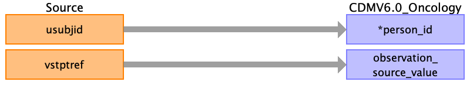

## Table name: observation

### Reading from vs.csv

| Destination Field | Source field | Logic | Comment field |
| --- | --- | --- | --- |
| observation_id |  |  |  |
| person_id | usubjid |  |  |
| observation_concept_id |  |  | Derived from observation_source_concept_id |
| observation_date |  |  | Derived from observation_datetime |
| observation_datetime |  |  | Would normally be VSRFTDTC, but it's missing from our dataset. |
| observation_type_concept_id |  |  |  |
| value_as_number |  |  |  |
| value_as_string |  |  |  |
| value_as_concept_id |  |  |  |
| qualifier_concept_id |  |  |  |
| unit_concept_id |  |  |  |
| provider_id |  |  |  |
| visit_occurrence_id |  |  |  |
| visit_detail_id |  |  |  |
| observation_source_value | vstptref |  |  |
| observation_source_concept_id |  |  | Derived from observation_source_value.  We will probably need to make custom concepts for this. |
| unit_source_value |  |  |  |
| qualifier_source_value |  |  |  |
| observation_event_id |  |  | FK to measurement associated with VSTPTREF |
| obs_event_field_concept_id |  |  | Hardcode as 1147140 (measurement.measurement_concept_id) |
| value_as_datetime |  |  |  |

