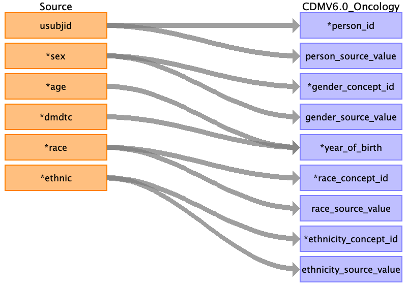

## Table name: person

### Reading from dm.csv

Remove any rows with an empty usubjid

| Destination Field | Source field | Logic | Comment field |
| --- | :-: | --- | --- |
| person_id |  | A unique system generated identifier | Auto-increment |
| person_source_value | usubjid |  |  |
| gender_concept_id | sex | `CASE dm.sex`   `WHEN 'M' THEN 8507`   `WHEN 'F' THEN 8532`   `ELSE 0` `END` |  |
| gender_source_value | sex |  |  |
| year_of_birth | age dmdtc | `YEAR(dmtc) - age`   |  |
| month_of_birth | NULL |  |  |
| day_of_birth | NULL |  |  |
| birth_datetime | NULL |  |  |
| death_datetime| dthdtc | Only record if `dthfl = 'Y'`  | v6 field |
| race_concept_id | msc.target_concept_id | `COALESCE(msc.target_concept_id, 0) `   `LEFT JOIN mapped_source_codes msc`   `ON msc.source_code = dm.race`   `AND msc.source_vocabulary_id = 'PHUSE_DM_RACE_maps_to'` |  |
| race_source_value | race |  |  |
| ethnicity_concept_id | msc.target_concept_id | `COALESCE(msc.target_concept_id, 0)`   `LEFT JOIN mapped_source_codes msc`   `ON msc.source_code = dm.ethnic`   `AND msc.source_vocabulary_id = 'PHUSE_DM_ETHNIC_maps_to'` |  |
| ethnicity_source_value | ethnic |  |  |
| location_id | NULL |  |  |
| provider_id | NULL |  |  |
| care_site_id | NULL |  |  |
| gender_source_concept_id |  | Populate with 0 |  |
| race_source_concept_id |  | Populate with 0 |  |
| ethnicity_source_concept_id |  | Populate with 0 |  |
