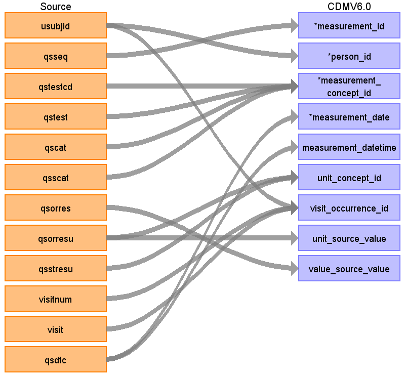

## Table name: measurement

### Reading from qsco.csv

| Destination Field | Source field | Logic | Comment field |
| --- | --- | --- | --- |
| measurement_id | qsseq |  | The qsseq may need to be recreated as the PHUSE QSCO does not have a unique sequential representation. |
| person_id | usubjid |  | Convert to integer representation of subjid OR auto-increment the person_id. Note: The original SDTM USUBJID will reside in the person_source_value to ensure traceability to and from person_id. |
| measurement_concept_id | qstestcd qstest qscat qsscat |  | Concept code=273269001, Concept ID=4157231, Vocabulary ID=SNOMED  This is where qstestcd, qstest, qscat, and qsscat may be extrpolated into a corresponding SNOMED concept.  The QSCO has QSCAT=ADAS-COG where its decode is equivalent to "ALZHEIMER'S DISEASE ASSESSMENT SCALE" |
| measurement_date | qsdtc |  | QSDTC may include a date in ISO 8601 datetime format. If both exist, then measurement_datetime, esle  measurement_date. As such, qsdtc has been mapped to both measurement_datetime and measurement_date but only one should exist. |
| measurement_datetime | qsdtc |  | QSDTC may include a date in ISO 8601 datetime format. If both exist, then measurement_datetime, esle  measurement_date. As such, qsdtc has been mapped to both measurement_datetime and measurement_date but only one should exist. |
| measurement_time |  |  |  |
| measurement_type_concept_id |  |  |  |
| operator_concept_id |  |  |  |
| value_as_number |  |  |  |
| value_as_concept_id |  |  |  |
| unit_concept_id | qsstresu qsorresu |  | UCUM concept correlation can be made to UCUM ID=8555 has Code=s with Name=second. The relative concept code for unit_concept_id should correspond to the mappings for unit_source_value and value_source_value (i.e., using either the original or standardized SDTM equivalents). |
| range_low |  |  |  |
| range_high |  |  |  |
| provider_id |  |  |  |
| visit_occurrence_id | visitnum visit usubjid |  | The concatenation of USUBJID, VISIT, and VISITNUM will make this unique in the visit_occurrence_ide. Please refere to the visit source table. |
| visit_detail_id |  |  |  |
| measurement_source_value |  |  |  |
| measurement_source_concept_id |  |  |  |
| unit_source_value | qsorresu |  | UCUM concept correlation can be made to UCUM ID=8555 has Code=s with Name=second. In SDTM, the qsorresu and qsstresu have the controlled terminology of "sec". For mapping, either the original (qsorresu) or standard (qsstresu) must be selected. This should also be done consistently throughout the mapping process. In this example, the original (qsorresu) was mapped. |
| value_source_value | qsorres |  | In SDTM, qsorres can be up to VARCHAR(200), which needs to be factored in. For mapping, either the original (qsorres) or standard (qsstresc/qsstresn) must be selected. This should also be done consistently throughout the mapping process. In this example, the original (qsorres) was mapped. |

