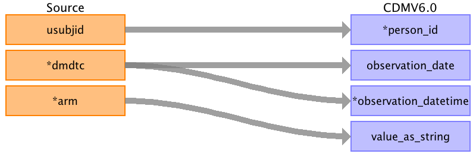

## Table name: observation

### Reading from dm.csv

| Destination Field | Source field | Logic | Comment field |
| --- | --- | --- | --- |
| observation_id |  |  |  |
| person_id | usubjid |  |  |
| observation_concept_id |  |  |  |
| observation_date | dmdtc |  |  |
| observation_datetime | dmdtc |  |  |
| observation_type_concept_id |  |  |  |
| value_as_number |  |  |  |
| value_as_string | arm |  |  |
| value_as_concept_id |  |  |  |
| qualifier_concept_id |  |  |  |
| unit_concept_id |  |  |  |
| provider_id |  |  |  |
| visit_occurrence_id |  |  |  |
| visit_detail_id |  |  |  |
| observation_source_value |  |  |  |
| observation_source_concept_id |  |  |  |
| unit_source_value |  |  |  |
| qualifier_source_value |  |  |  |
| observation_event_id |  |  |  |
| obs_event_field_concept_id |  |  |  |
| value_as_datetime |  |  |  |

