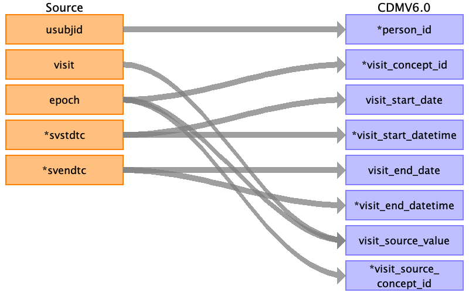

## Table name: visit_occurrence

### Reading from sv.csv

| Destination Field | Source field | Logic | Comment field |
| --- | --- | --- | --- |
| visit_occurrence_id |  | A unique system generated identifier | Auto-increment |
| person_id | cdm.person.person_id | `JOIN cdm.person`   `ON cdm.person.person_source_value = sv.usubjid` |  |
| visit_concept_id | msc.target_concept_id | `LEFT JOIN source_codes_mapped msc`  <code>ON msc.source_code = sv.epoch &#124;&#124; ':' &#124;&#124; sv.visit</code>  `AND msc.source_vocabulary_id = 'PHUSE_SV_VISIT'` | Target for visit_source_value |
| visit_start_date | sv.svstdtc |  | svstdtc is STRING format but written as YYYY-MM-DD; convert to DATE |
| visit_start_datetime | NULL |  |  |
| visit_end_date | sv.svendtc |  | svendtc is STRING format but written as YYYY-MM-DD; convert to DATE |
| visit_end_datetime | NULL |  |  |
| visit_type_concept_id |  | Populate with 32809 | Case Report Form |
| provider_id | NULL |  |  |
| care_site_id | NULL |  |  |
| visit_source_value | sv.visit  sv.epoch | `sv.epoch` <code> &#124;&#124; ':'</code> <code> &#124;&#124; sv.visit</code>  | Concatenation of epoch:visit |
| visit_source_concept_id |  | Populate with 0 |  |
| admitting_source_concept_id |  | Populate with 0 |  |
| admitting_source_value | NULL |  |  |
| discharge_to_concept_id |  | Populate with 0 |  |
| discharge_to_source_value | NULL |  |  |
| preceding_visit_occurrence_id |  |  | Derived in ETL |
| unique_visit_source |  | `sv.usubjid`  <code>&#124;&#124; '&#124;'</code> <code> &#124;&#124; sv.visitnum</code> | Temp field for ETL  Used for assigning visits to clinical events |
| rule_id |  | Populate with 'sv.1.visitnum' | Temp field for ETL |
| src |  | Populate with 'sv' | Temp field for ETL |
| src_row |  | Populate with the row number of the source table this record came from | Temp field for ETL |
