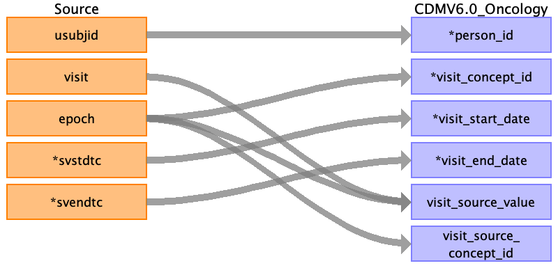

## Table name: visit_occurrence

### Reading from sv.csv

| Destination Field | Source field | Logic | Comment field |
| --- | --- | --- | --- |
| visit_occurrence_id |  |  |  |
| person_id | usubjid |  |  |
| visit_concept_id | epoch |  |  |
| visit_start_date | svstdtc |  | svstdtc is STRING format but written as YYYY-MM-DD; convert to DATE |
| visit_start_datetime | svstdtc |  | svstdtc is STRING format but written as YYYY-MM-DD; convert to DATETIME with time as 00:00:00 |
| visit_end_date | svendtc |  |  |
| visit_end_datetime | svendtc |  | svendtc is DATE format; convert to DATETIME with time as 00:00:00 |
| visit_type_concept_id |  |  | Hardcode as 32809 (Case Report Form) |
| provider_id |  |  |  |
| care_site_id |  |  |  |
| visit_source_value | visit epoch |  |  |
| visit_source_concept_id | epoch |  |  |
| admitting_source_concept_id |  |  |  |
| admitting_source_value |  |  |  |
| discharge_to_concept_id |  |  |  |
| discharge_to_source_value |  |  |  |
| preceding_visit_occurrence_id |  |  |  |

